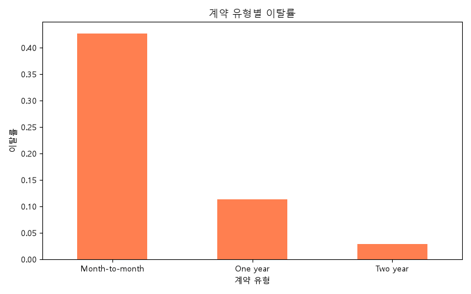
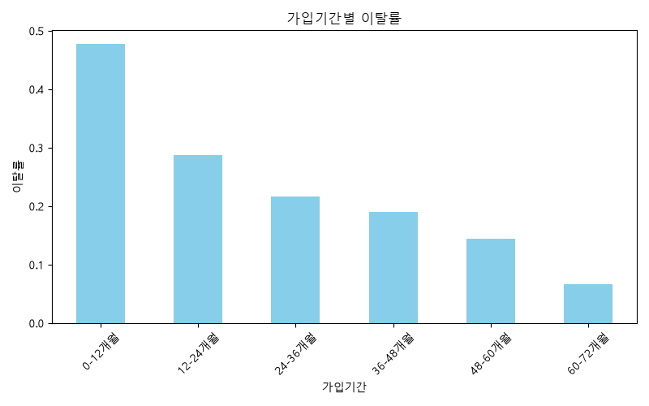
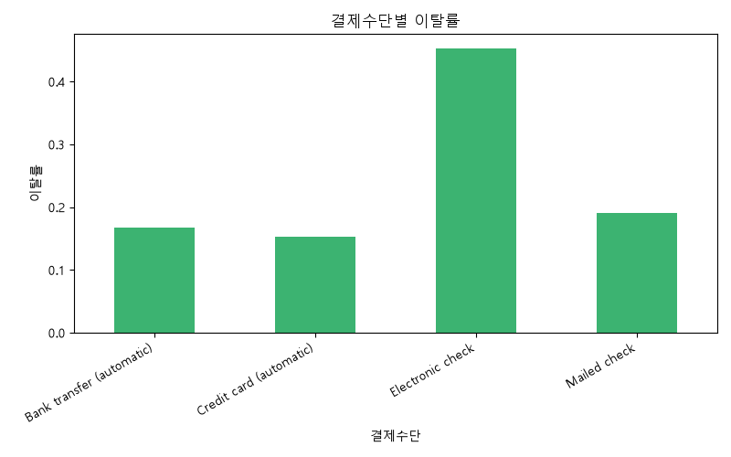

# SaaS 고객 이탈(Churn) 분석

## 프로젝트 목적

구독 기반 서비스에서 고객 이탈은 매출에 직접적인 영향을 미치는 핵심 지표입니다. 이 프로젝트는 Telco 고객 데이터를 활용해 **어떤 고객이 이탈할 가능성이 높은지, 어떤 요인이 이탈에 영향을 미치는지**를 분석하고, 실제 서비스 운영 시 리텐션 전략에 활용할 수 있는 인사이트를 도출하는 것을 목표로 합니다.

## 데이터 소개

- **출처**: [Kaggle - Telco Customer Churn](https://www.kaggle.com/datasets/blastchar/telco-customer-churn)
- **규모**: 7,043명의 고객 데이터, 21개 컬럼
- **주요 컬럼**: 계약 유형(Contract), 가입 기간(tenure), 결제 수단(PaymentMethod), 월 요금(MonthlyCharges), 이탈 여부(Churn) 등
- **결측치**: 없음

## 분석 과정

pandas의 `groupby`와 `value_counts`를 활용해 SQL의 `GROUP BY` 개념과 동일한 방식으로 세그먼트별 이탈률을 계산했습니다.

```python
# 계약 유형별 이탈률 (SQL: GROUP BY Contract)
df.groupby('Contract')['Churn'].value_counts(normalize=True).unstack()

# 가입기간 구간 나누기 (SQL: CASE WHEN)
df['tenure_group'] = pd.cut(df['tenure'], bins=[0, 12, 24, 36, 48, 60, 72],
                              labels=['0-12개월', '12-24개월', '24-36개월',
                                      '36-48개월', '48-60개월', '60-72개월'])
```

분석한 질문은 다음 4가지입니다.
1. 계약 유형별 이탈률 차이는?
2. 가입 기간이 짧을수록 이탈률이 높은가?
3. 결제 수단별 이탈률 차이는?
4. 이탈 고객과 잔존 고객의 월 요금 차이는?

## 핵심 인사이트

### 1. 계약 유형이 이탈률을 가장 크게 좌우한다

| 계약 유형 | 이탈률 |
|---|---|
| Month-to-month | 42.7% |
| One year | 11.3% |
| Two year | 2.8% |



월 단위 계약 고객의 이탈률이 2년 계약 고객보다 **15배 이상** 높습니다. 장기 계약 유도가 리텐션에 가장 효과적인 레버일 수 있습니다.

### 2. 가입 초기 6~12개월이 가장 위험한 구간이다

| 가입 기간 | 이탈률 |
|---|---|
| 0-12개월 | 47.7% |
| 12-24개월 | 28.7% |
| 24-36개월 | 21.6% |
| 36-48개월 | 19.0% |
| 48-60개월 | 14.4% |
| 60-72개월 | 6.6% |



가입 기간이 늘어날수록 이탈률이 꾸준히 감소합니다. 특히 **가입 후 1년 이내 고객**에게 온보딩 및 리텐션 캠페인을 집중할 필요가 있습니다.

### 3. 특정 결제 수단이 이탈과 강하게 연관되어 있다

| 결제 수단 | 이탈률 |
|---|---|
| Electronic check | 45.3% |
| Mailed check | 19.1% |
| Bank transfer (automatic) | 16.7% |
| Credit card (automatic) | 15.2% |



Electronic check 결제 고객의 이탈률이 자동이체 고객보다 **약 3배** 높습니다. 결제 편의성 부족 또는 결제 실패 경험이 이탈로 이어질 가능성이 있어 보입니다.

### 4. 이탈 고객이 잔존 고객보다 더 비싼 요금을 내고 있다

- 잔존 고객 평균 월 요금: **$61.3**
- 이탈 고객 평균 월 요금: **$74.4**

요금이 비쌀수록 서비스 가치에 대한 기대치가 높아지고, 그 기대에 못 미칠 경우 이탈로 이어질 가능성을 시사합니다.

## 결론 및 제안

분석 결과를 종합하면, **"가입 1년 이내 + 월 단위 계약 + Electronic check 결제"** 조합의 고객이 이탈 고위험군입니다. 이 회사(또는 유사한 SaaS/구독 서비스)라면 다음과 같은 액션을 고려할 수 있습니다.

1. 신규 가입 고객(0-12개월)을 대상으로 한 온보딩 강화 및 조기 이탈 방지 캠페인
2. 월 단위 계약 고객에게 장기 계약 전환 시 혜택 제공
3. Electronic check 결제 고객의 결제 경험 점검 및 자동이체 전환 유도

## 사용 기술

- Python (pandas, matplotlib)
- 데이터 전처리 및 세그먼트 분석 (SQL GROUP BY 개념 적용)
- 시각화 (matplotlib)

## 프로젝트 구조

```
saas-churn-analysis/
├── README.md
├── analysis.py
├── data/
│   └── WA_Fn-UseC_-Telco-Customer-Churn.csv
└── images/
    ├── contract_churn.png
    ├── tenure_churn.png
    └── payment_churn.png
```
